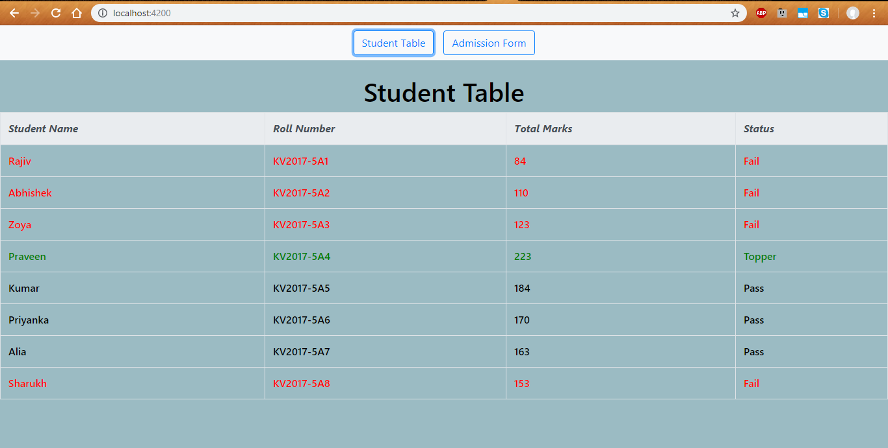

# studentDashboard
Added angular &amp; spring boot code

-> This is an assignment to create a table displaying a list of students(Receieved in JSON format from studentDashboard/students API created using spring-boot) with their perfomances in the exam & on basis of it, differentiating which students passed,failed the exams & identifying topper.  
-> The Second page or tab includes an admission Form(Angular Reactive Form) which asks for student details & have various validations included. 
-> This repository includes both Angular frontend & Spring boot backend api code.

<h4>Below are the screenshots of the running application-</h4>

